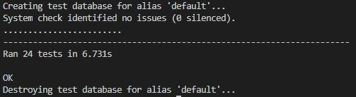

## Testing

### Validator Testing
* HTML
    * All pages have been passed through the [W3C validator](https://validator.w3.org/) using URI input. An initial check flagged two spurious end tags and some issues with the iframe styles. These problems have been corrected.
    * No errors are now returned for all pages.
* CSS
    * All pages have been passed through the [Jigsaw validator](https://jigsaw.w3.org/css-validator/) using URI input and the CSS file has also been passed through using direct input.
    * No errors have been found for all pages.
* JS
    * The Javascript snippets have been passed through the [Beautify Tools](https://beautifytools.com/javascript-validator.php) validator. The bootstrap alert on the timeout function is flagged as not defined but is defined elsewhere.
    * No other errors have been found.
* Python
    * All Python files have been passed through the [PEP8 online](http://pep8online.com/) check with no errors flagged.
    * The Gitpod built in linter has also been used throughout development to improve the Python code through the shortening of lines and addition of docstrings.

### Python Automated Testing

Automated testing on all original Python code was carried out on both project apps using the Django testing framework. The following tests were carried out:

* **Restaurant App - Models**
    * The Restaurant model string method returns the restaurant name.
    * The Restaurant closing time must be later than the opening time.
    * The Restaurant Menu field defaults to 'placeholder'.
    * The Table model string method returns the expected string.
* **Restaurant App - Views**
    * The get index page view returns a successful HTTP response and uses the correct template.
* **Restaurant App - Results**
    * All tests passed.

* **Bookings App - Models**
    * The Booking model string method returns the expected string.
    * The Booking end_time is generated on save and is 2 hours after the time field.
    * The Booking updated field defaults to true.
* **Bookings App  - Forms**
    * The correct booking form fields are listed in the meta class.
    * The booking form gives a validation error if no tables are available.
* **Bookings App - Views**
    * The various get views return a successful HTTP response and use the correct templates.
    * The delete_booking view successfully deletes a booking and redirects to the correct page both for a user and a superuser.
    * The toggle_updated view changes the value of the booking updated field.
    * The add_table_no view sets the table_numbers field.
    * The restaurant owner only pages redirect other users to the homepage and display the correct message.
    * The make_booking view makes a booking and redirects correctly based on the user.
    * The update_booking view updates an existing booking and redirects correctly based on the user.
    * Both the make_booking and update_booking views generate an error message when there are no tables available.
* **Bookings App - Available Table Check**
    * The smallest available table is chosen when no table combination required.
    * The smallest table combination is chosen when tables are combined.
    * Larger table combinations are chosen when the smallest is not available.
    * Booked tables are not selected.
    * The booked table is considered available in any table search when updating a booking.
* **Bookings App - Results**
    * All tests passed.

### Manual Testing

Continuous manual testing was carried out throughout the development process with display or functionality errors corrected as they appeared. Detail of some of the manual testing is listed below:

* **Navigation Bar**
    * All navigation bar links have been tested on desktop and mobile and work correctly.
    * The navigation dropdown menu displays correctly when the arrow has been clicked and the dropdown links work correctly.
    * The registered user and superuser links only display when the correct users are logged in.
* **Footer**
    * The social media links take the user to the correct page and open in a new tab.
* **Homepage**
    * The book a table button on the homepage goes to the correct page.
    * The homepage view menu button launches the menu in a new tab.
* **Make Booking Page**
    * The login and register links for non registered users go to the correct pages.
    * Time and party sizse dropdown inputs work as expected and the date input launches a calendar widget as expected.
    * The form cannot be submitted without all required inputs entered.
    * A form error and alert error message are both displayed when there are no tables available.
    * The make booking button submits the form.
    * The page redirects to the booking confirmed page, or manage bookings page when a booking is made and a success message is displayed.
* **Booking Confirmed Page**
    * The Update link for registered users goes to the correct page.
    * The Cancel Booking link correctly launches the confirmation modal.
    * The booking is successfully cancelled on confirmation.
* **My Bookings Page**
    * The Book Table button goes to the correct page.
    * The Update link goes to the correct page.
    * The Cancel Booking link launches the confirmation modal and the booking is cancelled on confirmation.
* **Manage Bookings Page**
    * The Add Booking button goes to the correct page.
    * Clicking on the update flag turns off the flag.
    * The add table number input adds table numbers to the booking.
    * The View and Update links go to the correct pages.
    * The Cancel Booking button launches the modal.
* **Booking Detail Page**
    * The Update Booking link and Back button go to the correct pages and the Cancel Booking correcly launches the confirmation modal.
    * The add table number input adds table numbers to the booking.
* **Update Booking Page**
    * The Back button goes to the correct pages.
    * The form is submitted when the Update Booking button is selected and the booking is updated correctly.
    * Updating a booking without changing the date, time or party size (not covered in manual testing) updates the booking as expected and does not reset the table number field.
* **Account Pages**
    * The login and register pages both redirect to the previous page on confirmation.
    * The user is redirected to the homepage after logout.
* **Alert Messages**
    * The messages appear correctly when relevant actions have been taken.
    * The timeout JS works correctly and the messages close as intended.
* **Device and Browser Testing**
    * The site has been tested on the Google Chrome, Microsoft Edge and Firefox browsers.
    * The sites responsivenes has be tested by friends and family members on various devices and also using the Chrome Developer tools.

